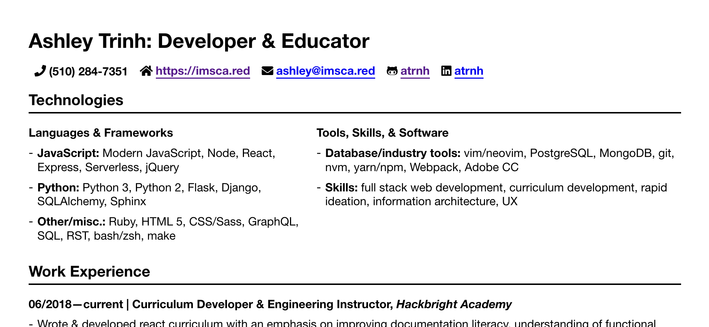

# resume-template

[Live demo](https://imsca.red/assets/resume.html)

## features

- Printer-friendly stylesheet!
- Jinja!
- Fontawesome!

## it's (mostly) easy to use!

1. Install dependencies
1. Put your info in `config.py`
1. Run `python3 render.py`
1. Your resume will be written to `out.html`!

